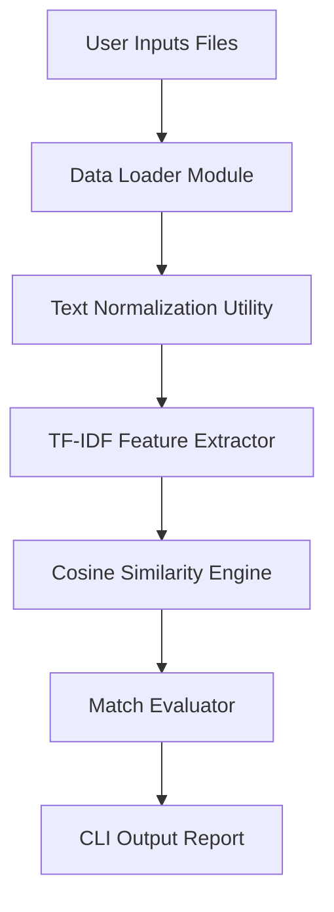
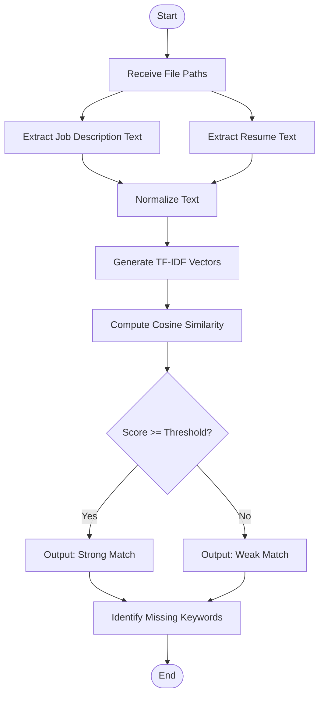
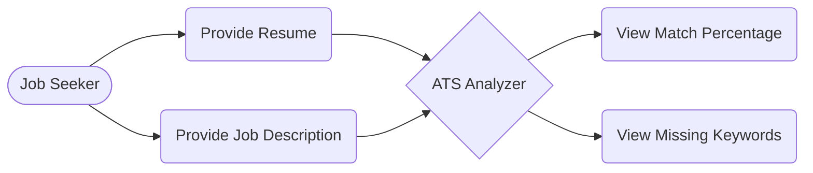
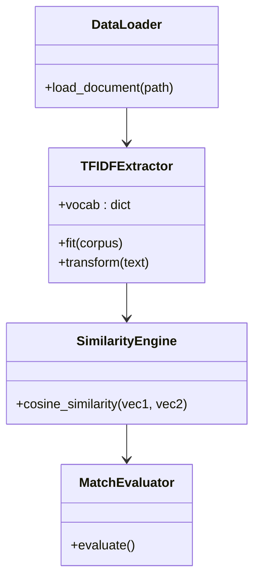
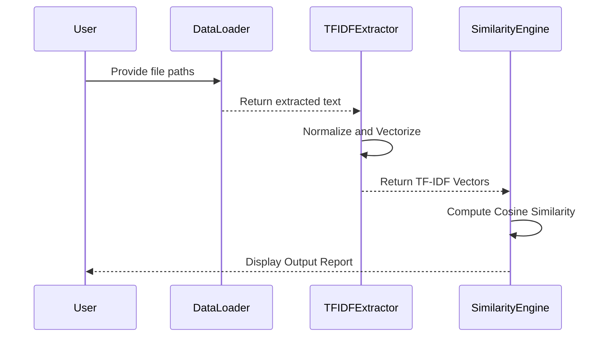

# Design Artifacts & Documentation

## 1. Problem Statement
Job seekers are frequently rejected by automated Applicant Tracking Systems (ATS) because they lack insight into the specific keywords required by the job description.

## 2. Objectives
- To develop a localized ATS simulation tool.
- To implement NLP algorithms for scoring resume compatibility.
- To output actionable feedback highlighting missing keywords.

## 3. Functional Requirements
1. **Document Parsing**: Read and extract text from `.txt` and `.pdf` files.
2. **Text Normalization**: Clean text by applying lowercase formatting and removing stop-words.
3. **Feature Extraction**: Generate TF-IDF vectors from the text corpus.
4. **Similarity Scoring**: Compute Cosine Similarity between vectors.
5. **Actionable Feedback**: Identify and display missing keywords.

## 4. Non-Functional Requirements
1. **Performance**: Utilize NumPy for efficient mathematical calculations.
2. **Security**: Process all data locally to ensure the privacy of candidate information.
3. **Usability**: Provide a clear and accessible Command-Line Interface (CLI).
4. **Reliability**: Implement error handling for unsupported or corrupt files.
5. **Logging**: Maintain an execution log (`app_debug.log`) for system monitoring.

## 5. System Architecture Diagram

## 6. Process Flow Diagram

## 7. UML Diagrams

### Use Case Diagram

### Class Diagram

### Sequence Diagram

## 8. Database/Storage Design
- **ER Diagram / Schema**: *Not Applicable (N/A)*. 
- **Storage Rationale**: This project was intentionally designed to operate entirely in-memory. Because resumes contain sensitive Personally Identifiable Information (PII), local file parsing is used without relying on a relational database, ensuring complete data privacy and security upon program termination.

## 9. Computation / ML Requirements

### Dataset Description
The system generates a dynamic micro-corpus at runtime. Instead of utilizing a pre-trained dataset, the dataset consists strictly of the specific Job Description and Resume provided by the user during execution.

### Model Selection Rationale
- **Why TF-IDF & Cosine Similarity?**: While complex deep learning models exist, they often function as opaque "black boxes". A resume analyzer requires transparency to identify exactly which keywords are missing. TF-IDF provides deterministic, mathematical feature weighting without hallucination, making it highly suitable for exact keyword analysis.

### Evaluation Methodology
The evaluation relies on a defined threshold metric. Cosine Similarity yields a normalized score between 0.0 and 1.0. If the calculated score meets the baseline threshold (0.65), the resume is considered a match. Missing keywords are identified by extracting features that possess a high TF-IDF weight in the job description vector but a weight of zero in the resume vector.
